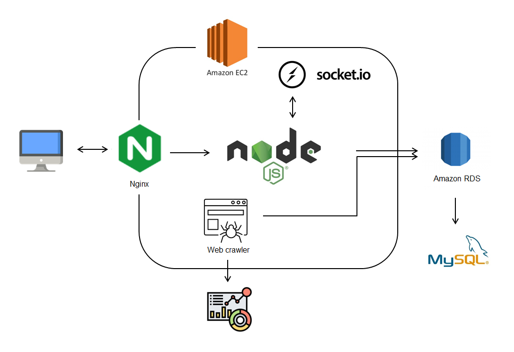

# Stock Arena

A stock game for reading stocks information, deciding your stocks portfolio and competing with others.

## Table of content
* [Technologies](#technologies)
* [Structure](#structure)
* [Database design](#database-design)
* [Features and Demonstration](#Features-and-Demonstration)
* [Guest account](#Guest-account)
* [Contact](#Contact)

## Technologies

### Backend
* Node.js
* Express.js
* AWS EC2
* Hbs

### Frontend
* HTML
* CSS
* JavaScript

### Realitime Web Application 
* Socket io

### Database
* MySQL
* AWS RDS

### Web Crawl
* Puppeteer
* Cheerio

### Test
* Mocha
* Chai

### Others
* Plot: D3, Hicharts
* Facebook login API

## Structure

- Redirects port requests by **NGINX** after receiving request from clients
- Constructed Web server on **AWS EC2**, established **MYSQL** on **AWS RDS**
- Realtime web application: **Socket**
- Scraped news content through **Web Crawler**

## Database design

## Features and Demonstration

* Game mode choices:

  * Single player game
  * Join website's chat-room to match with other player
* Stock Information:

  * Decide stock portfolio 
  * Stock's news
  * Stock's financial report
* Game result:

  * Calculate stock's return on investment 
  * Check the latest news and financial report
* Leaderboard and user profile:

  * Game result will be stored into leaderboard
  * Check and compare all others' result in leaderboard
  * Check user's own result and match game result in user profile.

## Guest account
* Account email: guest@gmail.com
* Account password: stock1234

## Contact
* Authur: Ting-Yuan Hsiao
* Email: yuanchris1@gmail.com