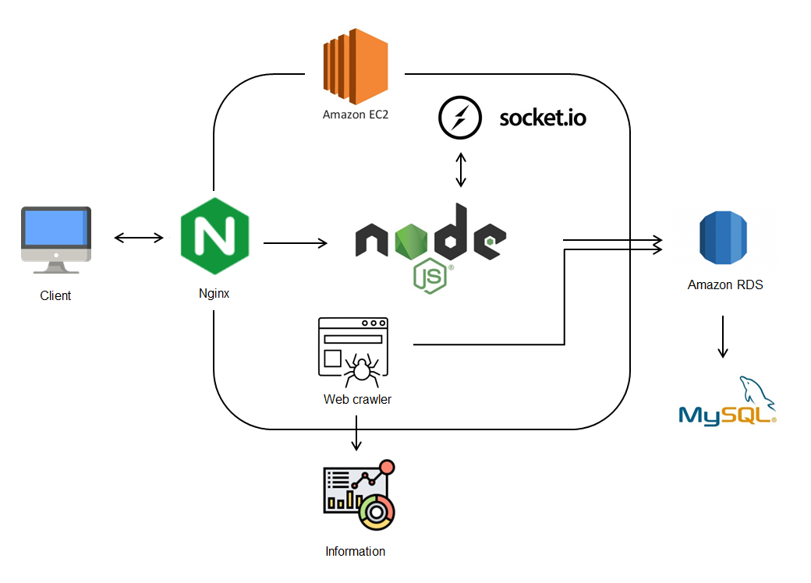
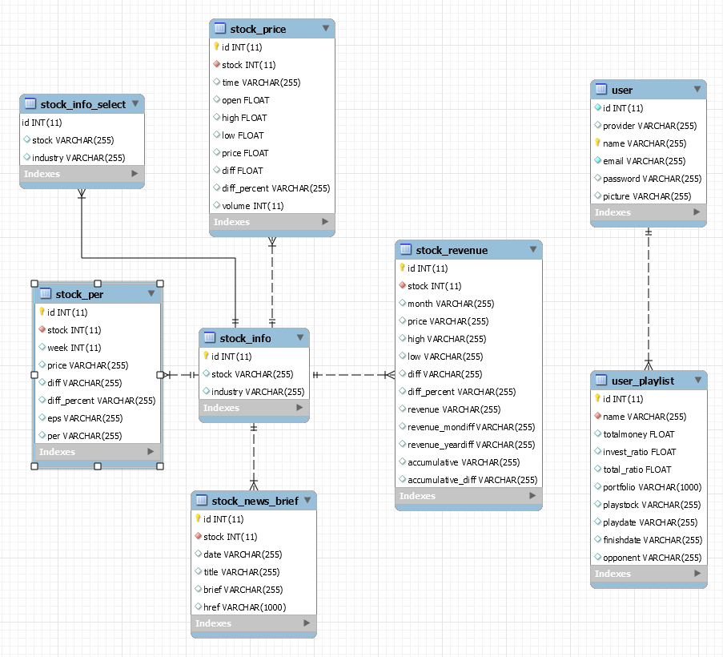

# Stock Arena

A stock game for reading stocks information, deciding your stocks portfolio and competing with others.

Website URL : https://stock-arena.duckdns.org/

## Table of content
- [Stock Arena](#stock-arena)
  - [Table of content](#table-of-content)
  - [Technologies](#technologies)
    - [Backend](#backend)
    - [Frontend](#frontend)
    - [Realitime Web Application](#realitime-web-application)
    - [Database](#database)
    - [Web Crawl](#web-crawl)
    - [Test](#test)
    - [Others](#others)
  - [Structure](#structure)
  - [Database design](#database-design)
  - [Features and Demonstration](#features-and-demonstration)
  - [Guest account](#guest-account)
  - [Contact](#contact)

## Technologies

### Backend
* Node.js
* Express.js
* AWS EC2
* Hbs

### Frontend
* HTML
* CSS
* JavaScript

### Realtime Web Application
* Socket.IO

### Database
* MySQL
* AWS RDS

### Web Crawl
* Puppeteer
* Cheerio

### Test
* Mocha
* Chai

### Others
* Plot: D3, Highcharts
* Facebook login API

## Structure

- Redirects port requests by **NGINX** after receiving request from clients
- Constructed Web server on **AWS EC2**, established **MYSQL** on **AWS RDS**
- Realtime web application: **Socket**
- Scraped news content through **Web Crawler**

## Database design

## Features and Demonstration

* Game mode choices:
  * Single player game
  * Join website's chat-room to match with other player
  
  

* Stock Information:
  * Decide stock portfolio 
  * Stock's news
  * Stock's financial report

  

* Game result:
  * Calculate stock's return on investment 
  * Check the latest news and financial report
  
  
  
* Leaderboard and user profile:
  * Game result will be stored into leaderboard
  * Check and compare all others' result in leaderboard
  * Check user's own result and match game result in user profile.
  
  
    

## Guest account
* Account email: guest@gmail.com
* Account password: stock1234

## Contact
* Author: Ting-Yuan Hsiao
* Email: yuanchris1@gmail.com
